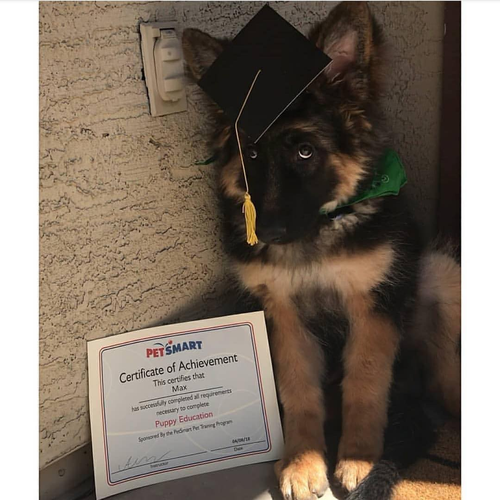
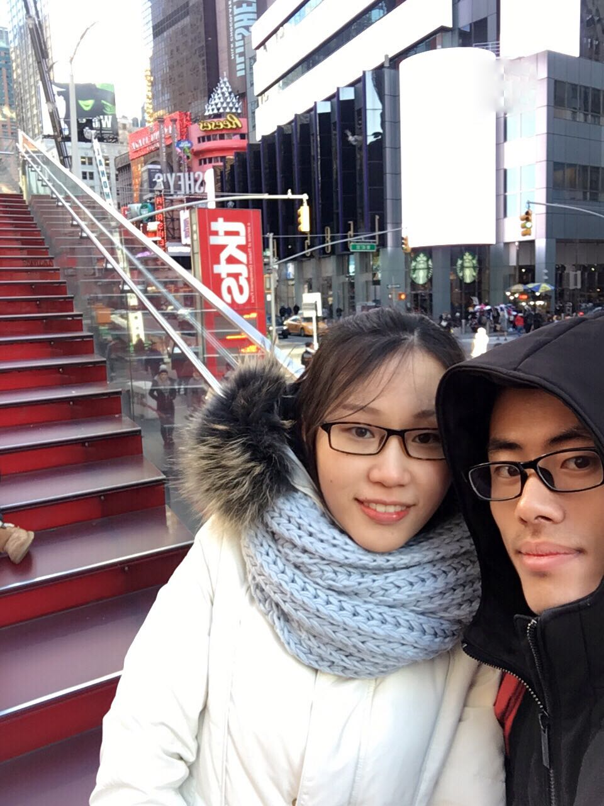

我是于华超。  
现在研习 **三维重建（SfM）**, **无人驾驶**，**系统集成**。  

### 关注：

- [Leetcode](https://leetcode.com/problemset/algorithms/)
- Python
- [Boost.Python](https://github.com/bryanibit/boost-python-examples)
- [OpenSfM](https://github.com/mapillary/OpenSfM/)
- [OpenDroneMap](https://github.com/OpenDroneMap/OpenDroneMap/)

### 我的朋友们

- [MasterIzumi](https://MasterIzumi.github.io)
- [jfqiu](https://github.com/jfqiu)
- [leooo48](https://leooo48.github.io)
- [gddxz_zhouhao](http://blog.csdn.net/gddxz_zhouhao)

### 联系

- [微博](http://weibo.com/u/2393223365)
- [Facebook](https://www.facebook.com/profile.php?id=100009262672437&ref=bookmarks)
- [github](https://github.com/bryanibit)

**群居守口，独居守心**  

趁你现在还有时间，尽你自己最大的努力，努力做成你最想做的那件事。成为你最想成为的那种人，过着你最想过的那种生活。这个世界永远比你想的要更精彩，不要败给生活。  
While there's time, try your best to achieve what you want most. And become what kind of man you admire, live what kind of life you desire. The world is always more fabulous than that you image. Do not lose to the life.  

