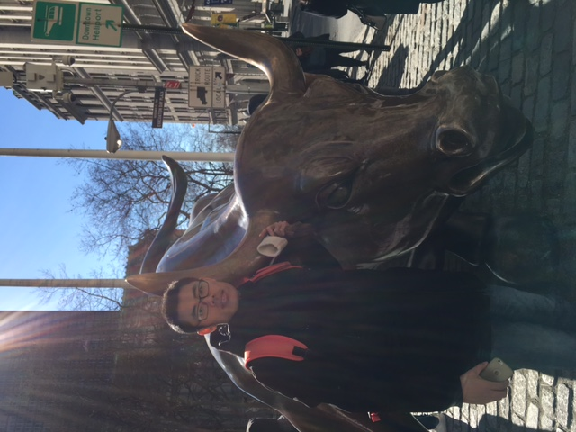

我是于华超，在读研究生。

现在研习 **三维重建（SfM）** 。

### 关注：

- [Leetcode](https://leetcode.com/problemset/algorithms/)
- Python
- [Boost.Python](https://github.com/bryanibit/boost-python-examples)
- [OpenSfM](https://github.com/mapillary/OpenSfM/)
- [OpenDroneMap](https://github.com/OpenDroneMap/OpenDroneMap/)

### 我的朋友们

- [MasterIzumi](https://MasterIzumi.github.io)
- [jfqiu](https://github.com/jfqiu)
- [leooo48](https://leooo48.github.io)
- [gddxz_zhouhao](http://blog.csdn.net/gddxz_zhouhao)

### 联系

- [微博](http://weibo.com/u/2393223365)
- [Facebook](https://www.facebook.com/profile.php?id=100009262672437&ref=bookmarks)
- [github](https://github.com/bryanibit)

